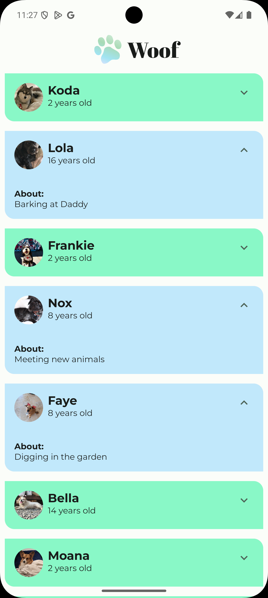
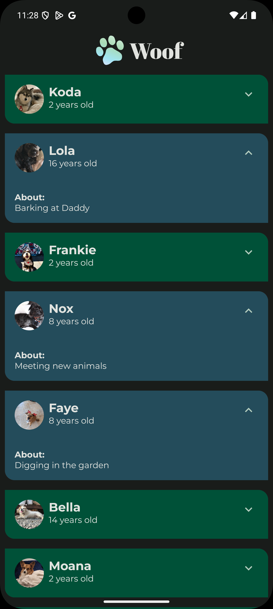

# Woof

> An interactive Jetpack Compose dog profiles app: browse a scrollable list of pups, tap to expand cards with spring-powered size and color animations, and switch between light & dark themes.

## Features

- **Expandable Cards**  
  Tap the “More” icon to expand each dog card and reveal hobbies.
- **Spring Animations**  
  Smooth animateContentSize and animateColorAsState transitions.
- **Light & Dark Mode**  
  Adapts UI colors to the current theme automatically.
- **LazyColumn List**  
  Efficiently renders a vertical list of dog profiles.

## Prerequisites

- Android Studio Arctic Fox or later
- Android SDK (API 21+)
- Kotlin & Jetpack Compose support enabled

## Screenshots

| Light Theme            | Dark Theme                  |
|:----------------------:|:----------------------------:|
|  |  |